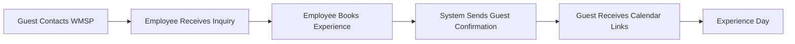

# WMSP VIP Booking System (Psybook)

A comprehensive employee portal for managing VIP wildlife experiences at West Midlands Safari Park. Built with .NET 9, Blazor WebAssembly, and enterprise-grade authentication for WMSP staff.

## 🌟 Overview

The WMSP VIP Booking System is an **internal employee portal** designed specifically for **West Midlands Safari Park staff** to manage VIP guest experiences. This secure system enables authorized WMSP employees to book exclusive VIP wildlife experiences on behalf of guests, with integrated calendar synchronization, comprehensive analytics, and administrative features.

> **⚠️ Important**: This is an internal employee system, not a guest-facing booking portal. Only authorized WMSP staff can access this system to manage guest bookings.

## 👥 User Roles & Access

### 🏢 **WMSP Employees** (Primary Users)
- **Booking Managers**: Create and manage VIP experience bookings for guests
- **Customer Service**: Handle guest inquiries and booking modifications
- **Administrators**: Configure experiences, view analytics, and manage system settings
- **Management**: Access comprehensive reports and business intelligence

### 👤 **Guests** (Indirect Beneficiaries)
- Guests **do not** have direct system access
- WMSP employees book experiences **on behalf** of guests
- Guests receive automated confirmations and calendar invitations
- Calendar integration allows guests to add experiences to personal calendars

## 🚀 Key Features

### 🔐 **Employee Authentication & Security**
- **Azure AD B2C Integration**: Enterprise-grade identity management for WMSP staff
- **Single Sign-On (SSO)**: Seamless authentication with WMSP credentials
- **Role-Based Authorization**: Secure access control for different employee roles
- **JWT Bearer Authentication**: Secure API endpoint protection
- **Claims-Based Identity**: Comprehensive user profile and permissions management
- **Multi-Factor Authentication**: Enhanced security for sensitive operations

### 📅 **Guest Booking Management**
- **Employee-Managed Bookings**: Staff create bookings on behalf of guests
- **Multiple Experience Types**: Rhino Keeper, Lion Feeding, Safari Driving, and more
- **Dynamic Calendar Interface**: Interactive booking calendar with drag-and-drop
- **Status Management**: Pending, Confirmed, Cancelled, Completed, No-Show tracking
- **Guest Information Management**: Comprehensive contact and address details
- **Automated Guest Notifications**: Email confirmations and reminders

### 📅 **Calendar Integration** (For Guests)
- **Multi-Platform Support**: Google Calendar, Outlook, Apple Calendar, and iCalendar (.ics)
- **One-Click Addition**: Direct URLs for guests to add experiences to their calendars
- **Auto-Sync**: Automated synchronization based on guest preferences
- **iCalendar Downloads**: Universal .ics files for any calendar application
- **Real-Time Updates**: Booking changes reflect immediately in external calendars

### 📊 **Employee Analytics & Reporting**
- **Comprehensive Dashboard**: Real-time metrics and KPIs for management
- **Interactive Charts**: Booking trends, revenue analytics, and experience performance
- **Multi-Format Export**: PDF, Excel, CSV, and JSON report generation
- **Scheduled Reports**: Automated report generation and email delivery
- **Real-Time Metrics**: Live dashboard monitoring system performance
- **Guest Insights**: Detailed guest behavior and segmentation analysis

### 🎨 **Modern Employee Interface**
- **Blazor WebAssembly**: Fast, responsive client-side application
- **MudBlazor Components**: Material Design UI components with advanced charting
- **Responsive Design**: Optimized for desktop, tablet, and mobile devices
- **Dark/Light Theme**: User-configurable theme preferences
- **Accessibility**: WCAG-compliant interface with screen reader support
- **Employee Profile Management**: Individual user settings and preferences

### 🔧 **Administrative Features**
- **Experience Configuration**: Setup and manage available VIP experiences
- **Booking Status Workflow**: Complete lifecycle management
- **Guest Communications**: Automated notifications and confirmations
- **Advanced Analytics**: Time-based, experience, and geographic analysis
- **Data Export**: Multiple format support with customizable parameters
- **Background Services**: Automated report scheduling and processing

## 👨‍💼 Employee Workflow

### 1. **Guest Inquiry Process**


### 2. **Employee Daily Tasks**
- **Manage Incoming Inquiries**: Handle guest requests for VIP experiences
- **Create Bookings**: Use system to book experiences on behalf of guests
- **Modify Reservations**: Update, reschedule, or cancel bookings as needed
- **Monitor Status**: Track booking lifecycle from inquiry to completion
- **Generate Reports**: Access analytics and business intelligence
- **Configure System**: Manage experience types, pricing, and availability

### 3. **Guest Experience Journey**
1. **Inquiry**: Guest contacts WMSP for VIP experience information
2. **Booking**: WMSP employee creates booking using internal system
3. **Confirmation**: Guest receives automated email with booking details
4. **Calendar Integration**: Guest adds experience to personal calendar
5. **Reminders**: Automated system sends pre-experience notifications
6. **Experience Day**: Guest enjoys VIP wildlife experience
7. **Follow-up**: Post-experience communication and feedback collection

## 🏗️ Architecture

### Solution Structure

```
Psybook/
├── 📁 Psybook.API/                    # RESTful API backend with JWT authentication
├── 📁 Psybook.UI/                     # Blazor Server hosting with Azure AD integration
├── 📁 Psybook.UI.Client/              # Blazor WebAssembly client with authorization
├── 📁 Psybook.Services/               # Business logic & external integrations
│   ├── 📁 UI/Clients/                 # HTTP client abstractions with auth tokens
│   ├── 📁 Reporting/                  # Analytics and reporting services
│   ├── 📁 Background/                 # Background service implementations
│   ├── 📁 ExternalCalendar/           # Guest calendar integration
│   └── 📁 Middleware/                 # Authentication and metrics middleware
├── 📁 Psybook.Repositories/           # Data access layer with audit logging
├── 📁 Psybook.Objects/                # Domain models & DTOs
│   └── 📁 Reporting/                  # Analytics and reporting models
├── 📁 Psybook.Shared/                 # Shared components & contexts
├── 📁 Psybook.Migrations/             # Database migration service
├── 📁 Psybook.AppHost/                # .NET Aspire orchestration
└── 📁 Psybook.ServiceDefaults/        # Common service configurations
```

### Technology Stack

| Layer | Technologies |
|-------|-------------|
| **Frontend** | Blazor WebAssembly, MudBlazor, HTML5, CSS3, JavaScript |
| **Backend** | ASP.NET Core Web API, Entity Framework Core |
| **Database** | SQL Server with Entity Framework migrations |
| **Authentication** | **Azure AD B2C, JWT Bearer tokens, Microsoft Identity Web** |
| **Authorization** | **Claims-based authorization, Role-based access control** |
| **Analytics** | Custom analytics engine, MudBlazor charts, real-time metrics |
| **Background Services** | .NET BackgroundService, scheduled reporting, email delivery |
| **Hosting** | .NET Aspire, Docker containerization |
| **External APIs** | Microsoft Graph, Google Calendar API |
| **Build & Deploy** | .NET 9, CI/CD pipelines, Azure DevOps |

## 🔐 Authentication & Security Implementation

### Employee Authentication System
- **Azure AD B2C**: Enterprise identity provider for WMSP employees
- **OpenID Connect**: Modern authentication protocol implementation
- **Single Sign-On**: Seamless integration with existing WMSP systems
- **Multi-Factor Authentication**: Enhanced security for sensitive operations
- **JWT Tokens**: Secure API communication with bearer token validation

### Security Features
- **Employee-Only Access**: System restricted to authorized WMSP staff
- **Claims-Based Authorization**: Fine-grained permission control
- **API Endpoint Protection**: All controllers secured with `[Authorize]` attributes
- **HTTPS Enforcement**: All communications encrypted with TLS
- **Input Validation**: Comprehensive sanitization and validation
- **Audit Logging**: Complete tracking of employee actions and system changes

### Authentication Pages & Components
- **LoginDisplay Component**: Employee authentication UI with profile dropdown
- **Profile Page** (`/profile`): Employee account management and claims display
- **Authentication Info** (`/auth-info`): System documentation and security overview
- **Help & Support** (`/help`): Employee-specific help resources and contact information

## 📋 Detailed Project Breakdown

### 🌐 **Psybook.API** (Secured)
RESTful API backend providing authenticated endpoints for:
- **Booking Management**: CRUD operations for VIP bookings (Employee-only)
- **Calendar Integration**: iCalendar generation and external calendar sync
- **Reports & Analytics**: Comprehensive analytics and report generation (Management)
- **Status Management**: Booking lifecycle and workflow automation
- **Authentication Middleware**: JWT validation and user context
- **Data Validation**: Comprehensive input validation and sanitization

**Secured Controllers:**
- `BookingController`: Core booking operations with employee authentication
- `CalendarIntegrationController`: External calendar sync for guest bookings
- `ReportingController`: Analytics and dashboards with role-based access
- `ExperienceController`: VIP experience configuration (Admin-only)

### 🖥️ **Psybook.UI & Psybook.UI.Client** (Employee Interface)
Modern Blazor application with employee authentication:
- **Interactive Calendar**: Heron.MudCalendar integration for booking visualization
- **Analytics Dashboard**: Real-time reporting with interactive charts
- **Responsive Components**: Mobile-first design with adaptive layouts
- **Authentication State**: AuthorizeView components for role-based UI
- **Theme System**: Dark/light mode with user preferences
- **Employee Profile**: User account management and system information

**Key Authenticated Components:**
- `Home.razor`: Main employee dashboard with booking calendar
- `Book.razor`: Employee interface for creating guest bookings
- `Reports.razor`: Management analytics and reporting dashboard
- `ExperienceConfiguration.razor`: Admin interface for system configuration
- `Profile.razor`: Employee profile and account management
- `AuthInfo.razor`: System documentation and authentication information
- `LoginDisplay.razor`: Employee authentication and profile dropdown

### 🔧 **Psybook.Services** (with Authentication)
Business logic and external integrations with security:

#### **Authenticated API Clients**
- `IBookingClient`: HTTP client with JWT token authentication
- `IReportingClient`: Secured reporting and analytics client
- `HttpClientExtensions`: Token handling and error management

#### **Employee Services**
- `IReportingService`: Employee analytics and business intelligence
- `IDataVisualizationService`: Chart and graph data for management
- `ScheduledReportingService`: Automated report generation for management

#### **Guest Integration Services**
- `IExternalCalendarService`: Guest calendar integration abstraction
- `GoogleCalendarApiService`: Google Calendar API client for guest bookings
- `UserCalendarPreferencesService`: Guest calendar preference management

## 🛠️ Setup & Installation

### Prerequisites

- **.NET 9 SDK** (latest version)
- **SQL Server** (LocalDB, Express, or full version)
- **Visual Studio 2024** or **Visual Studio Code**
- **Azure AD B2C Tenant** (for employee authentication)
- **Node.js** (for JavaScript tooling)
- **Git** for version control

### Employee Authentication Setup

1. **Configure Azure AD B2C**
```json
// appsettings.json
{
  "AzureAd": {
    "Instance": "https://login.microsoftonline.com/",
    "Domain": "wmsp.onmicrosoft.com",
    "TenantId": "{{YOUR_WMSP_TENANT_ID}}",
    "ClientId": "{{YOUR_APPLICATION_CLIENT_ID}}",
    "CallbackPath": "/signin-oidc",
    "Scopes": "access_as_user"
  }
}
```

2. **Setup Database with Employee Audit**
```json
// appsettings.json
{
  "ConnectionStrings": {
    "wmsp-db": "Server=(localdb)\\mssqllocaldb;Database=PsybookEmployee;Trusted_Connection=true;"
  }
}
```

### Quick Start

1. **Clone the Repository**
```bash
git clone https://github.com/Shenbury/Psybook.git
cd Psybook
```

2. **Configure Employee Authentication**
   - Set up Azure AD B2C tenant for WMSP
   - Configure application registration
   - Update `appsettings.json` with tenant details

3. **Run Database Migrations**
```bash
dotnet ef database update --project Psybook.Shared
```

4. **Start the Application**
```bash
dotnet run --project Psybook.AppHost
```

5. **Access Employee Portal**
- **Employee Portal**: https://localhost:7031 (Requires WMSP login)
- **Reports Dashboard**: https://localhost:7031/reports (Management access)
- **API Documentation**: https://localhost:7032/swagger (Developer access)
- **Health Checks**: https://localhost:7033/health

### Development Setup

#### Using .NET Aspire (Recommended)

```bash
# Install .NET Aspire workload
dotnet workload install aspire

# Run the complete solution with authentication
dotnet run --project Psybook.AppHost
```

## 🔗 API Integration (Employee Authenticated)

### Authentication Required Endpoints

All API endpoints require valid JWT tokens from authenticated WMSP employees:

#### Employee Booking Management
```http
Authorization: Bearer {employee-jwt-token}

GET /api/booking/slots                   # View all guest bookings
GET /api/booking/slot/{id}              # View specific booking
POST /api/booking/slot                  # Create guest booking
PUT /api/booking/slot/{id}              # Modify guest booking
POST /api/booking/slot/{id}/status      # Update booking status
POST /api/booking/slot/{id}/confirm     # Confirm guest booking
POST /api/booking/slot/{id}/cancel      # Cancel guest booking
```

#### Management Reports & Analytics
```http
Authorization: Bearer {employee-jwt-token}

GET /api/reporting/dashboard            # Management dashboard
POST /api/reporting/analytics           # Comprehensive analytics
GET /api/reporting/trending-data        # Chart data
POST /api/reporting/generate            # Export reports
GET /api/reporting/realtime-metrics     # Live metrics
POST /api/reporting/schedule            # Schedule automated reports
```

#### Guest Calendar Integration
```http
Authorization: Bearer {employee-jwt-token}

GET /api/calendarintegration/booking/{id}/icalendar    # Generate guest calendar file
GET /api/calendarintegration/booking/{id}/urls        # Get guest calendar URLs
POST /api/calendarintegration/booking/{id}/sync       # Sync to guest calendar
```

### Usage Examples with Authentication

#### Employee Booking Creation
```razor
@using Psybook.Services.UI.Clients
@inject IBookingClient BookingClient
@attribute [Authorize] // Employee authentication required

<BookingForm />

@code {
    private async Task CreateGuestBooking(BookingRequest request)
    {
        // Employee JWT token automatically included
        var booking = await BookingClient.CreateBookingAsync(request);
        // Guest automatically receives confirmation email
    }
}
```

#### Management Analytics Access
```razor
@using Psybook.Services.UI.Clients
@inject IReportingClient ReportingClient
@attribute [Authorize] // Management access required

<Reports />

@code {
    private async Task LoadManagementAnalytics()
    {
        var request = new ReportRequest
        {
            StartDate = DateTime.UtcNow.AddDays(-30),
            EndDate = DateTime.UtcNow,
            ReportType = ReportType.Management
        };
        
        // Employee context automatically applied
        var analytics = await ReportingClient.GetAnalyticsAsync(request);
    }
}
```

## 🧪 Testing Employee System

### Employee Test Scenarios

- **Employee Login**: Test Azure AD B2C authentication flow
- **Guest Booking Creation**: Verify employees can book for guests
- **Booking Lifecycle**: Test status management and notifications
- **Management Reports**: Validate analytics and reporting access
- **Calendar Integration**: Test guest calendar link generation
- **Security**: Verify unauthorized access prevention

### Test Employee Accounts

For development and testing, create test employee accounts in Azure AD B2C:
- **Manager Account**: Full access to all features and reports
- **Operator Account**: Booking management and basic reporting
- **Viewer Account**: Read-only access to bookings and limited reports

### Running Tests

```bash
# Unit tests with authentication mocking
dotnet test

# Integration tests with test employee accounts
dotnet test --filter Category=Integration

# End-to-end tests with full authentication flow
dotnet test --filter Category=E2E
```

## 🚀 Deployment for Employee System

### Production Environment Configuration

#### Azure AD B2C Production Setup
- Configure production Azure AD B2C tenant
- Set up employee user flows and policies
- Configure MFA requirements for sensitive operations
- Set up role-based access control

#### Production Settings
```json
{
  "ConnectionStrings": {
    "wmsp-db": "{{AZURE_SQL_CONNECTION_STRING}}"
  },
  "AzureAd": {
    "Instance": "https://login.microsoftonline.com/",
    "Domain": "wmsp.onmicrosoft.com",
    "TenantId": "{{PRODUCTION_TENANT_ID}}",
    "ClientId": "{{PRODUCTION_CLIENT_ID}}"
  },
  "EmployeeRoles": {
    "Administrator": "WMSP.Admin",
    "Manager": "WMSP.Manager", 
    "Operator": "WMSP.Operator",
    "Viewer": "WMSP.Viewer"
  }
}
```

## 📊 Employee Performance & Monitoring

### Employee Activity Monitoring

- **Login Tracking**: Monitor employee authentication patterns
- **Booking Activity**: Track employee booking creation and modifications
- **System Usage**: Monitor feature usage and performance per employee
- **Error Tracking**: Employee-specific error logging and resolution
- **Audit Trails**: Complete audit logs for compliance and security

### Employee-Specific Metrics

- **Booking Velocity**: Bookings created per employee per day/week
- **Guest Satisfaction**: Correlation between employee and guest feedback
- **System Efficiency**: Time spent on booking tasks and system navigation
- **Training Needs**: Identification of areas where employees need additional training

## 🔒 Enhanced Security for Employee System

### Employee Access Control

- **Principle of Least Privilege**: Employees only access features needed for their role
- **Session Management**: Secure session handling with automatic timeout
- **Device Trust**: Device registration and trust management
- **Location-Based Access**: Optional geo-fencing for on-site access only

### Compliance & Auditing

- **GDPR Compliance**: Full guest data protection and employee access logging
- **SOX Compliance**: Financial data access controls and audit trails
- **Employee Training**: Security awareness and system usage training
- **Regular Security Reviews**: Periodic access reviews and permission updates

## 📞 Employee Support & Resources

### Employee Help Resources

- **Help & Support Page** (`/help`): Employee-specific help documentation
- **Profile Management** (`/profile`): Employee account settings and information
- **Authentication Info** (`/auth-info`): System overview and security documentation
- **Training Materials**: Interactive tutorials and best practices guides

### Internal Support Channels

- **IT Helpdesk**: Technical support for system access and functionality
- **Training Team**: System usage training and best practices
- **Management Portal**: Supervisor access to employee activity and performance
- **Documentation Wiki**: Comprehensive system documentation and procedures

---

## 🔧 Current Implementation Status

| Feature | Status | Version | Access Level |
|---------|--------|---------|--------------|
| **Employee Authentication** | ✅ Complete | v1.3.0 | All Staff |
| **Guest Booking Management** | ✅ Complete | v1.0.0 | Operators+ |
| **Calendar Integration** | ✅ Complete | v1.1.0 | All Staff |
| **Management Reports** | ✅ Complete | v1.2.0 | Managers+ |
| **Experience Configuration** | ✅ Complete | v1.2.0 | Admins Only |
| **Employee Profile System** | ✅ Complete | v1.3.0 | All Staff |
| **Role-Based Authorization** | 🔄 In Progress | v1.4.0 | Future |
| **Mobile Employee App** | 📅 Planned | v2.0.0 | Future |
| **Advanced Employee Analytics** | 📅 Planned | v2.1.0 | Future |

**Current Version**: v1.3.0 (Employee Authentication Complete)  
**Next Release**: v1.4.0 - Role-Based Authorization (Q4 2024)  
**LTS Support**: .NET 9 through November 2026

---

*Built with ❤️ by Simon Henbury for the West Midlands Safari Park team - Empowering employees to create unforgettable VIP wildlife experiences for guests.*